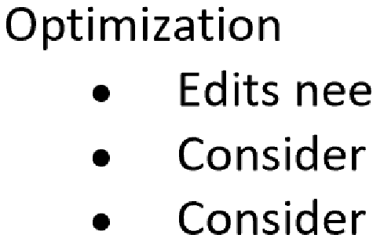
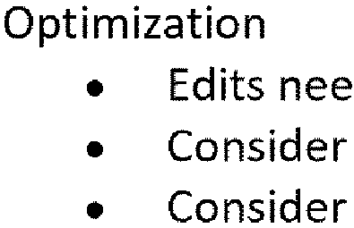
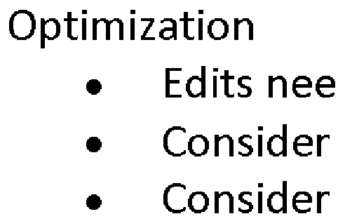

# One BPP Hack

## Why

Most uses of D2D are for screen, where RGB permits anti-aliased pretty text (or cleartype).

Anti-aliased (default):

When printing to a 1bpp printer (a label printer or fax machine), the default behavior is
to rasterize the text to RGB/Grayscale then dither the resultant bitmap.  It produces "fuzzies"
on the side of the text.

Dithered (🤮):

What is desired is that the text renderer directly work in black/white.  Fonts are 
specifically developed to handle this ([Font Hinting](https://en.wikipedia.org/wiki/Font_hinting)) 
and the result is much better.

Aliased (desired):

## How

The PDF renderer is inserting calls to `SetTextRenderingParams` and other alias control
methods.  From what I can tell, this is to disable cleartype and to respect the PDF default
aliasing of images.  We don't want these calls, so `OneBppDeviceContext` filters them out.

A slight second complexity is that the renderer seems to render internally to a command
list, then call `DrawImage` with that `ID2D1CommandList`.  We have to replay that list
against our context to intercept the `SetTextRenderingParams` calls in the list.